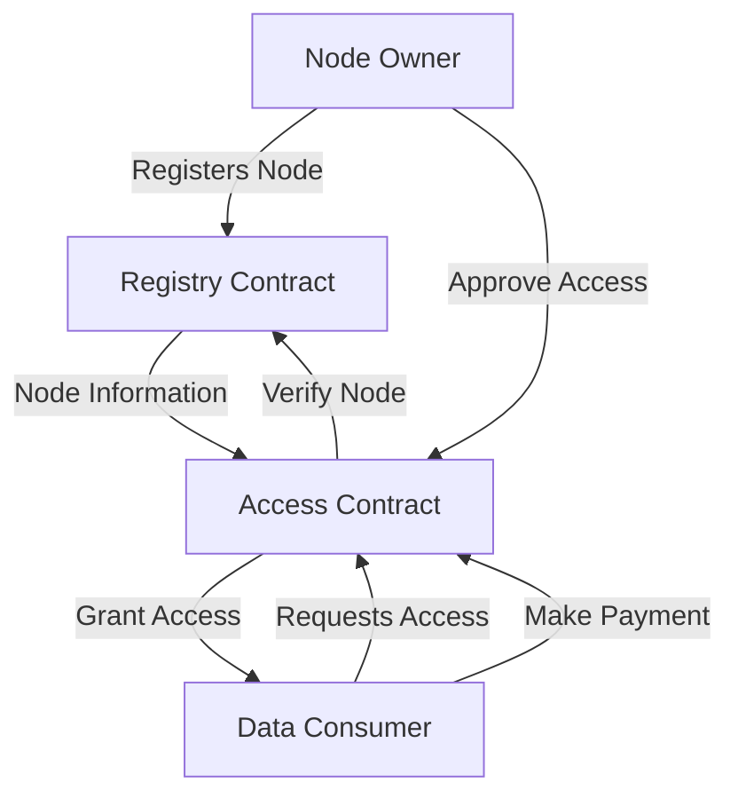

# SaveRing: Decentralized Trust Management

SaveRing is a decentralized trust and access management platform built on the Stacks blockchain that enables secure registration, verification, and controlled access to digital and physical resources. The platform creates a trustless ecosystem where resource owners can manage their assets, while consumers can discover and request access to valuable resources.

## Overview

The SaveRing platform provides:

- Secure registration and management of resources
- Fine-grained access control and permissions
- Reputation and trust tracking
- Flexible access models (one-time and recurring)
- Decentralized discovery of valuable resources

### Key Features

- Resource registration with comprehensive metadata
- Verification system for trusted entities
- Dynamic reputation scoring
- Access tracking and auditing
- Granular access request workflow
- Multi-tier payment and access models
- Secure permission management

## Architecture

The system consists of two main smart contracts that work together to provide the complete functionality:



### Core Contracts

1. **SaveRing Registry Contract** (`save-ring-registry.clar`)
   - Manages resource registration and metadata
   - Handles entity verification and status
   - Tracks reputation and trust metrics

2. **SaveRing Access Contract** (`save-ring-access.clar`)
   - Manages access requests and authorization
   - Handles access payment and processing
   - Enforces access control mechanisms

## Contract Documentation

### Registry Contract

The registry contract serves as the central database for IoT nodes in the ecosystem.

#### Key Functions

```clarity
(define-public (register-node (name (string-ascii 100)) 
                             (description (string-ascii 500))
                             (location (string-ascii 100))
                             (capabilities (string-ascii 500))
                             (data-types (string-ascii 500))
                             (refresh-rate uint)
                             (price-per-request uint))
```

- Registers a new IoT node with metadata
- Returns the unique node ID

```clarity
(define-public (update-node-status (node-id uint) (new-status uint))
```

- Updates node operational status (active/inactive/maintenance)
- Only callable by node owner

```clarity
(define-public (rate-node (node-id uint) (rating uint))
```

- Allows users to rate nodes (1-5 scale)
- Updates node reputation metrics

### Access Contract

The access contract manages permissions and payment processing for node access.

#### Key Functions

```clarity
(define-public (request-access (node-id uint) 
                              (purpose (string-ascii 100))
                              (duration-blocks uint)
                              (payment-amount uint)
                              (payment-type uint)
                              (payment-interval uint))
```

- Submits request for node access
- Supports one-time and subscription payments

```clarity
(define-public (approve-access (request-id uint))
```

- Approves access request and processes payment
- Only callable by node owner

```clarity
(define-public (verify-access (node-id uint) (requester principal))
```

- Verifies if a requester has valid access to a node
- Used by other contracts for access control

## Getting Started

### Prerequisites

- Clarinet (latest version)
- Stacks wallet for deployment and testing

### Installation

1. Clone the repository
2. Initialize Clarinet project:
```bash
clarinet new loopnode
```
3. Copy contract files to `contracts/` directory
4. Run tests:
```bash
clarinet test
```

### Basic Usage

1. Register a node:
```clarity
(contract-call? .loopnode-registry register-node 
    "Temperature Sensor" 
    "Environmental monitoring sensor" 
    "New York" 
    "Temperature, Humidity" 
    "celsius, percent" 
    u300 
    u100)
```

2. Request access:
```clarity
(contract-call? .loopnode-access request-access 
    node-id 
    "Research project" 
    u1000 
    u50 
    u1 
    u100)
```

## Security Considerations

- Node owners should carefully verify access requests before approval
- Access permissions are time-bound and can be revoked
- Subscription payments must be maintained to keep access active
- Node reputation should be considered when requesting access
- Contract admin functions should be properly secured in production

## Development

### Testing

Run the test suite:
```bash
clarinet test tests/loopnode_test.ts
```

### Local Development

1. Start local chain:
```bash
clarinet start
```

2. Deploy contracts:
```bash
clarinet deploy
```

3. Interact using console:
```bash
clarinet console
```